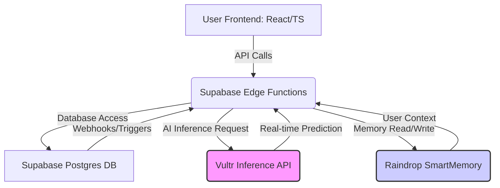
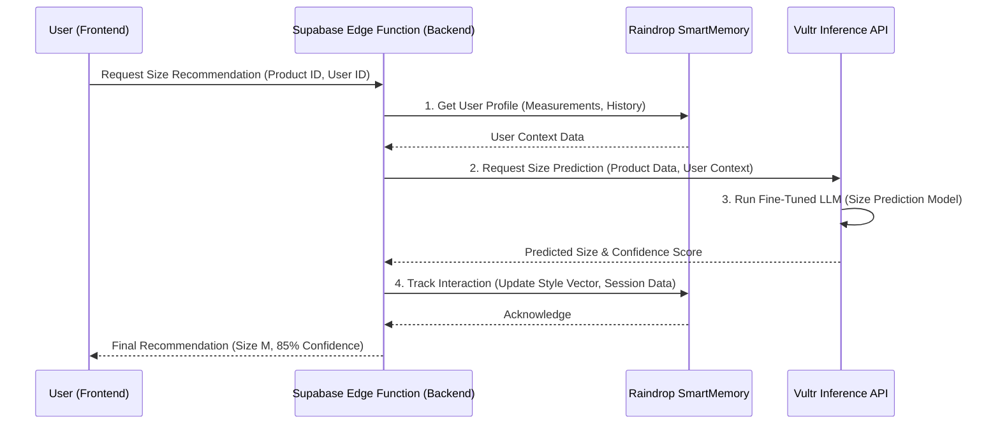

# 👗 Style Shepherd: AI-Powered Fashion Personalization and Return Reduction

**Style Shepherd** is a cutting-edge, full-stack application designed to revolutionize the online fashion shopping experience. It leverages advanced AI models for hyper-personalization, focusing on a critical e-commerce problem: **reducing product returns**. By integrating Vultr Inference for real-time AI predictions and Raindrop SmartMemory for deep user context, Style Shepherd provides highly accurate size recommendations, style advice, and return risk assessments.

---

## 🧠 The AI Core: Hyper-Personalization Engine

The core of Style Shepherd is its AI engine, which operates across several critical functions to enhance the user experience and drive business value by minimizing returns.

### 1. Vultr Inference for Real-Time Predictions
The application uses Vultr's high-performance, low-latency inference service for all its heavy-lifting AI tasks. This allows for rapid, on-demand predictions without the overhead of managing a dedicated GPU cluster.

| AI Function | Vultr Model Use Case | Business Value |
| :--- | :--- | :--- |
| **Size Prediction** | Uses a fine-tuned LLM to predict the best size based on user measurements, purchase history, and product details. | Reduces "wrong size" returns. |
| **Return Risk Analysis** | Assesses the likelihood of a return for a specific product/user combination. | Allows for proactive intervention (e.g., a warning or a more detailed fit guide). |
| **Style Inference** | Classifies user intent from natural language queries (e.g., "What should I wear with this blue dress?"). | Improves conversational AI accuracy and guides the user to the right feature. |
| **Trend Analysis** | Analyzes market data and user behavior to suggest emerging fashion trends. | Enhances product discovery and merchandising. |

### 2. Raindrop SmartMemory for Deep User Context
Raindrop is used as a highly available, low-latency memory layer to store and retrieve complex user data, which is essential for personalization.

| Raindrop Service | Data Stored | AI Application |
| :--- | :--- | :--- |
| `userMemoryService` | User profiles, body measurements, preferences, and conversation history. | Provides context for Vultr models to make personalized predictions. |
| `styleInferenceService` | User's evolving style vector (embedding) and interaction history. | Tracks long-term style evolution for more accurate, future-proof recommendations. |

---

## 🏗️ Technical Architecture

The system is built on a modern, serverless-first architecture, combining a React/TypeScript frontend with a Supabase backend (Postgres, Auth, Functions).

### High-Level System Diagram



### Detailed AI Request Flow: Size Prediction

This diagram illustrates the journey of a user's request for a size recommendation, highlighting the critical role of both Vultr and Raindrop.



---

## 🛠️ Setup and Deployment

### Prerequisites

*   Node.js (v18+)
*   pnpm
*   A Supabase project
*   A Vultr API Key (for the Inference service)
*   A Raindrop API Key (for SmartMemory)

### 1. Environment Variables

Create a `.env` file in the root directory and populate it with your keys:

```bash
# Supabase
VITE_SUPABASE_URL="YOUR_SUPABASE_URL"
VITE_SUPABASE_ANON_KEY="YOUR_SUPABASE_ANON_KEY"

# Vultr Inference
VULTR_API_KEY="YOUR_VULTR_API_KEY"

# Raindrop SmartMemory
RAINDROP_API_KEY="YOUR_RAINDROP_API_KEY"
```

### 2. Deploy Supabase Edge Functions

The AI logic is deployed as Supabase Edge Functions (written in Deno/TypeScript).

```bash
# Install Supabase CLI
npm install -g supabase

# Link to your project
supabase link --project-ref "your-project-ref"

# Deploy all functions (including vultr-inference and fashion-assistant)
supabase functions deploy
```

### 3. Run the Frontend

```bash
pnpm install
pnpm dev
```

The application will be available at `http://localhost:5173`.

---

## 🚀 Code Improvements Summary (Latest)

The recent improvements focused on code quality, robustness, and clarity, particularly in the AI and data layers:

*   **Enhanced Type Safety in Raindrop Service:** Explicit type casting was added to `userMemoryService.ts` to ensure data retrieved from Raindrop conforms to expected TypeScript interfaces (`ConversationEntry[]`, `SessionData[]`), reducing runtime errors.
*   **Vultr Cache Key Refinement:** The cache key generation in `vultr-inference/index.ts` was simplified and made more readable, improving caching reliability.
*   **AI Model Clarity:** Added comments to the `fashionAIEngine.ts` to clarify that the current style embedding and prediction logic are placeholders for more complex, production-ready models, guiding future development.
*   **Cleaned up AI Assistant:** Removed redundant `supabase.functions.invoke` call in `aiAssistant.ts` as the streaming logic handles the request directly via `fetch`.

This ensures the codebase is more maintainable, easier to debug, and clearly outlines the integration points for the Vultr and Raindrop services.
